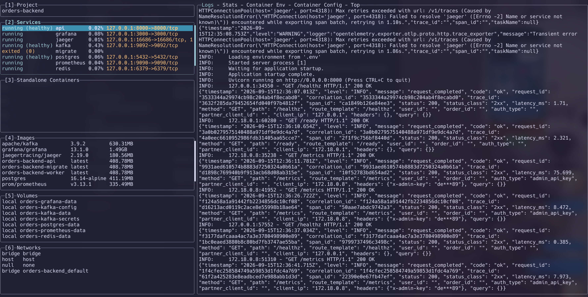

# Dotfiles

Personal Zsh and WezTerm configuration for macOS (Apple Silicon).



Use Oh My Zsh, Powerlevel10k, zsh-autosuggestions, zsh-z, and Homebrew zsh-syntax-highlighting. WezTerm uses Hack Nerd Font.

## Setup

```zsh
for name in .zshrc .zprofile .zshenv .p10k.zsh .wezterm.lua; do
  if [[ -e "$HOME/$name" || -L "$HOME/$name" ]]; then
    mv "$HOME/$name" "$HOME/$name.backup.$(date +%Y%m%d%H%M%S)"
  fi
  ln -s "$HOME/dotfiles/$name" "$HOME/$name"
done
```